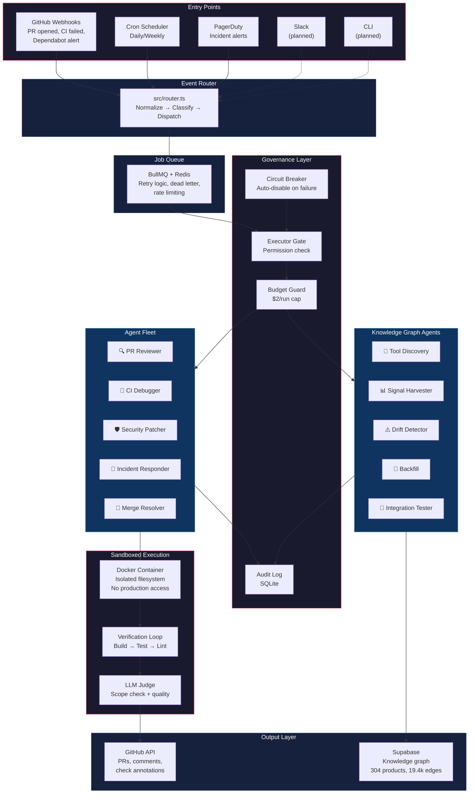
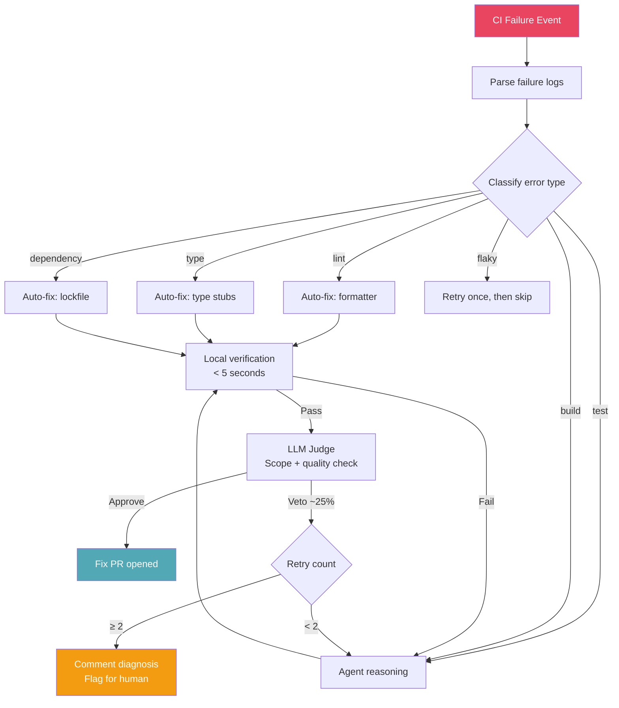
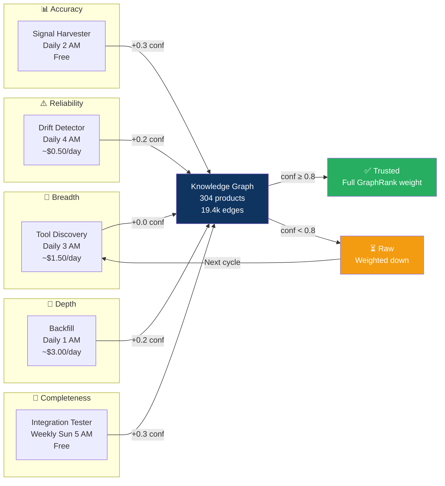
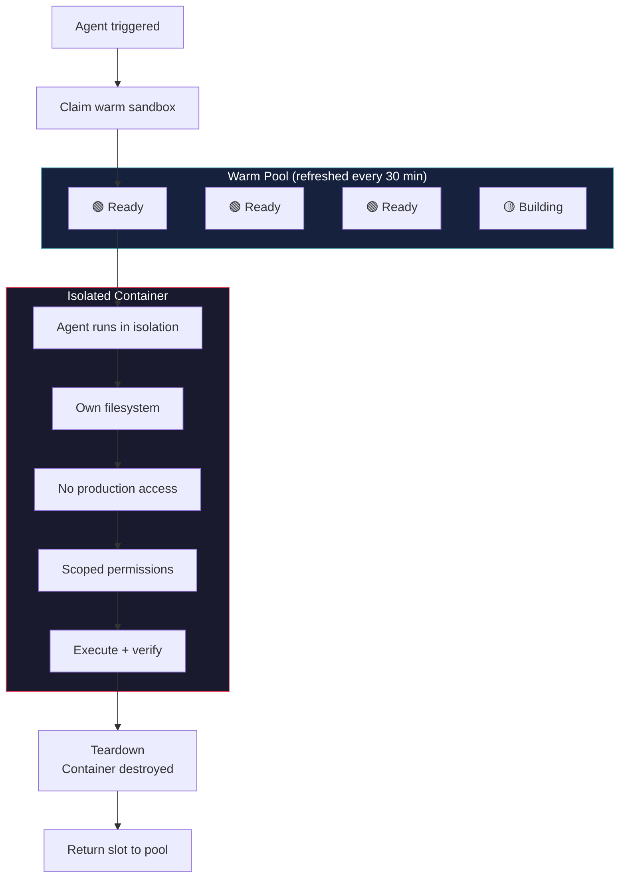
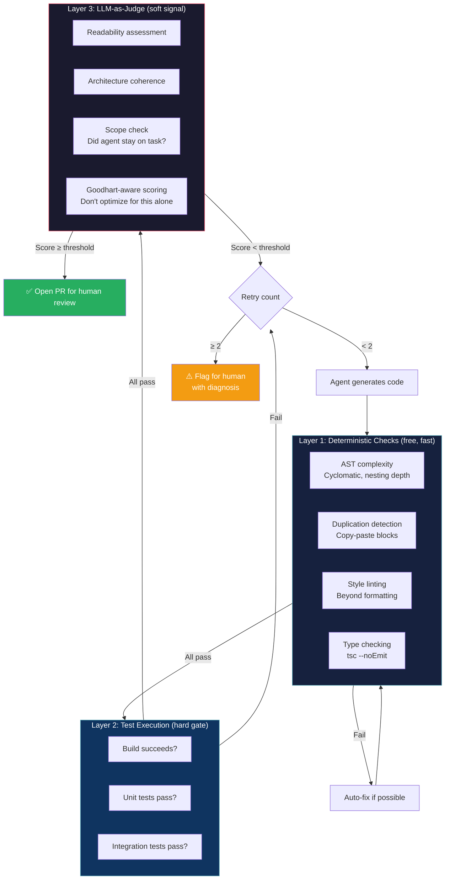
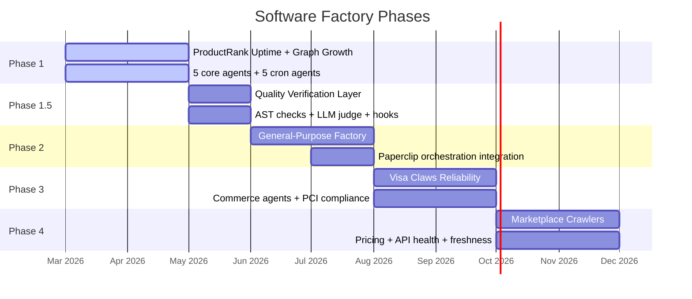
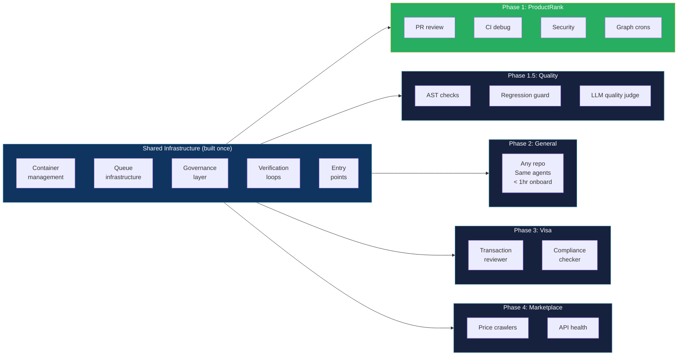
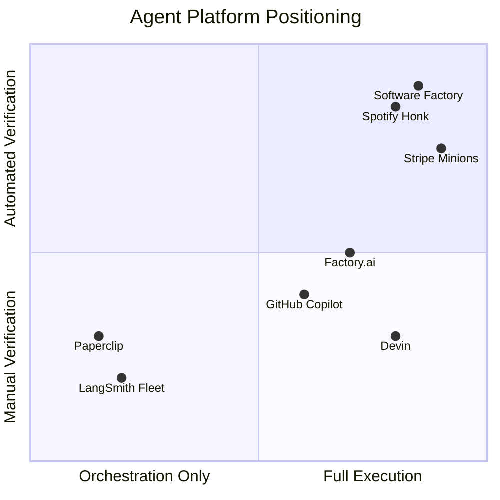

# Software Factory

An agent-native software development platform that autonomously handles PR review, CI debugging, security patching, incident response, and merge conflict resolution. Background agents work continuously — developers stay **on the loop** instead of in the loop.

Built for [ProductRank](https://github.com/alecgutman/productrank) and designed to extend into [Visa's agentic commerce platform](https://github.com/alecgutman/productrank/blob/main/.planning/FUTURE-FEATURES.md).

**Key thesis:** Agents produce working but low-quality code, and instruction-based constraints (CLAUDE.md, AGENTS.md) don't enforce quality. The solution is programmatic verification — deterministic checks + LLM judge + bounded retries. See [`docs/karpathy-software-factory-thesis.md`](docs/karpathy-software-factory-thesis.md) for the full evidence base.

---

## Why Build This?

Three companies have proven this pattern at scale:

| Company | System | Result | Key Insight |
|---------|--------|--------|-------------|
| **Spotify** | [Honk](https://engineering.atspotify.com/2025/11/spotifys-background-coding-agent-part-1) | 1,500+ merged PRs, 50% of all PRs automated | Containerized K8s execution + verification loops + LLM judge. Claude Code is top-performing agent. |
| **Ramp** | [Inspect](https://builders.ramp.com/post/why-we-built-our-background-agent) | 30% of all PRs in months | Modal sandboxes with warm pools, multiplayer sessions, filesystem snapshots. Sessions are fast to start and effectively free to run. |
| **Stripe** | [Minions](https://stripe.dev/blog/minions-stripes-one-shot-end-to-end-coding-agents) | 1,300 PRs/week, zero human-written code | Goose fork + isolated devboxes (10s spin-up) + 400 MCP tools via "Toolshed". Max 2 CI retries — diminishing returns after that. |

**The pattern is clear:** isolated sandboxes, PRs as review gates, humans review before merge. We apply the same architecture to ProductRank's knowledge graph maintenance and Visa's commerce platform.

---

## System Topology



---

## Agent Lifecycle

Every agent — whether triggered by a webhook or cron — follows the same lifecycle:

```mermaid
stateDiagram-v2
    [*] --> EventReceived: Webhook / Cron / Alert

    EventReceived --> GovernanceCheck: Normalize event

    state GovernanceCheck {
        [*] --> Permissions: Check executor gate
        Permissions --> BudgetCheck: Allowed?
        BudgetCheck --> Proceed: Under $2 cap?
        Proceed --> [*]
    }

    GovernanceCheck --> ContextBuild: Passed

    state ContextBuild {
        [*] --> FileTree: Read repo structure
        FileTree --> RecentChanges: Git log / diff
        RecentChanges --> RelevantCode: Scope to affected files
        RelevantCode --> [*]
    }

    ContextBuild --> AgentReasoning: Full context ready

    state AgentReasoning {
        [*] --> LLMCall: Analyze problem
        LLMCall --> GenerateFix: Produce code changes
        GenerateFix --> [*]
    }

    AgentReasoning --> Verification: Changes generated

    state Verification {
        [*] --> LocalChecks: Lint + format (< 5s)
        LocalChecks --> TestExecution: Build + test in sandbox
        TestExecution --> LLMJudge: Passes? → Scope check
        LLMJudge --> Retry: Veto? (max 2 retries)
        Retry --> LocalChecks: Try again
        LLMJudge --> Approved: Looks good
        Approved --> [*]
    }

    Verification --> Output: Verified

    state Output {
        [*] --> CreatePR: Open PR with explanation
        CreatePR --> AuditLog: Log all actions
        AuditLog --> [*]
    }

    Output --> HumanReview: PR ready
    HumanReview --> [*]: Merge or reject
```



---

## Core Agents

### 1. PR Reviewer
| | |
|---|---|
| **Trigger** | `pull_request.opened` / `pull_request.synchronize` |
| **Output** | Review comments + approval/request changes |
| **Prompt** | `src/agents/prompts/pr-reviewer.md` |

### 2. CI Debugger
| | |
|---|---|
| **Trigger** | `check_suite.completed` (failure) |
| **Output** | Diagnosis comment + fix PR on new branch |
| **Prompt** | `src/agents/prompts/ci-debugger.md` |

The CI debugger follows a **shift-left feedback loop** (Stripe/Spotify pattern):



**Key CI debugging patterns from production (Spotify Part 3):**
- **Verification loops** — Agent doesn't know what verifiers do, just that it must call them. Verifiers activate automatically based on file detection (e.g., `pom.xml` → Maven verifier, `package.json` → npm verifier).
- **Error parsing** — Don't send raw CI logs to the agent. Use regex to extract only relevant error messages. This saves context window and improves fix accuracy.
- **LLM Judge** — After fix passes CI, a separate LLM evaluates the diff against the original prompt. Catches "ambitious" agents that refactor unrelated code or disable flaky tests.
- **Bounded retries** — Stripe caps at 2 CI rounds. Spotify uses 10 turns per session, 3 session retries total. More iterations hit diminishing returns.

### 3. Security Patcher
| | |
|---|---|
| **Trigger** | `dependabot_alert.created` / CVE feed cron |
| **Output** | Patch PR with explanation |
| **Prompt** | `src/agents/prompts/security.md` |

### 4. Incident Responder
| | |
|---|---|
| **Trigger** | PagerDuty webhook / custom alert |
| **Output** | Root cause analysis + fix PR |
| **Prompt** | `src/agents/prompts/incident.md` |

### 5. Merge Resolver
| | |
|---|---|
| **Trigger** | `pull_request` with conflict label |
| **Output** | Conflict resolution commit |
| **Prompt** | `src/agents/prompts/merge.md` |

---

## Knowledge Graph Agents (Cron)

Five autonomous agents expand the ProductRank knowledge graph daily. Each agent updates a product's `confidence` score — products graduate from "raw" to "trusted" as confidence accumulates.



**Total daily cost:** ~$5/day (~$150/month)

**The flywheel:** Each validation cycle makes the graph both larger and more reliable. New products enter as "raw" and graduate to "trusted" as they accumulate confidence across multiple agent passes.

---

## Sandbox & Execution Model



Lessons applied from the three production systems:

### Containerized Execution (Spotify Pattern)
- Agents run in **isolated containers** — each gets its own filesystem, limited permissions, no network access to production
- Verifiers activate automatically based on project detection (Maven, npm, Gradle, etc.)
- Agent doesn't know verifier internals — abstracted behind MCP tool interface

### Warm Pools (Ramp + Stripe Pattern)
- Pre-built images refreshed every 30 minutes with latest repo state
- Snapshot/restore for fast session resumption
- Agent starts reading files immediately (block writes until sync completes)

### Governance
- **Cost caps**: $2/run default, tracked per-agent
- **Timeouts**: 5-minute hard kill
- **Blast radius**: Each agent scoped to relevant files only
- **Audit**: Every LLM call, GitHub API call, and file change logged
- **No force pushes, no direct main commits** — everything through PRs

---

## Verification Architecture

The quality problem is industry-wide. Karpathy admits "agents don't listen to AGENTS.md." Alibaba's SWE-CI benchmark shows 75% of agents break working code. Our answer: three layers of verification.



**Why three layers?**
- Layer 1 catches 60%+ of issues for free (linting, types, duplication)
- Layer 2 is the hard gate — if it doesn't work, it doesn't ship
- Layer 3 catches subtle quality issues (scope creep, readability, architecture) that deterministic tools miss
- Goodhart's Law risk: agents optimized solely for LLM judge approval will game the metric. Hard constraints (tests pass, builds succeed) are the real gate.

---

## Context Engineering

From Spotify's Part 2 — context engineering is the single biggest lever for agent quality:

### Prompt Design (What Works)
- **Describe the end state**, not step-by-step instructions (Claude Code prefers outcome-oriented prompts)
- **State preconditions** — tell the agent when NOT to act (prevents impossible tasks across heterogeneous repos)
- **Use examples** — concrete code snippets heavily influence output quality
- **One change at a time** — combining changes exhausts context window and produces partial results
- **Define success as tests** — "make this code better" fails; "these tests should pass" succeeds

### Tool Strategy (Less Is More)
- Spotify limits agents to: verify MCP (formatters/linters/tests), Git tool (restricted), Bash (strict allowlist)
- No code search or docs tools — context goes in the prompt upfront
- Stripe takes the opposite approach: 400+ MCP tools via Toolshed, pre-hydrated before agent starts
- **Our approach:** Start constrained (Spotify-style), add tools only when prompts aren't enough

### Conditional Rules (Stripe Pattern)
- Global agent rules don't work in large codebases — they conflict across different domains
- Apply rules conditionally by subdirectory: `src/agents/` gets agent-specific rules, `src/core/` gets infra rules
- Use `.cursorrules` / `AGENTS.md` / `CLAUDE.md` files scoped to directories

---

## Entry Points

Inspired by Stripe's multi-entry design (Slack is most common, then CLI, web, internal tools):

| Entry Point | Status | Description |
|-------------|--------|-------------|
| **GitHub Webhooks** | ✅ Built | Primary trigger for PR review, CI debug, security, merge |
| **Cron Jobs** | ✅ Built | Knowledge graph agents (discovery, signals, drift, backfill, integration) |
| **Alert Webhooks** | ✅ Built | PagerDuty/custom alerts → incident responder |
| **Slack** | 🔮 Planned | Tag bot in thread → classify repo → kick off agent (Stripe/Ramp pattern) |
| **CLI** | 🔮 Planned | `sf run --agent=ci-debugger --pr=123` |
| **Web UI** | 🔮 Planned | Session dashboard, live agent streaming, usage metrics |

---

## Tech Stack

| Layer | Technology | Why |
|-------|-----------|-----|
| **Runtime** | Node.js + TypeScript | Type safety, ecosystem |
| **Server** | Hono | Lightweight, fast, Cloudflare-ready |
| **LLM** | OpenRouter | Model-agnostic (Claude, GPT, Gemini, DeepSeek) |
| **GitHub** | Octokit + GitHub App auth | PR creation, review comments, check annotations |
| **Queue** | BullMQ + Redis | Reliable event processing with retries |
| **Audit DB** | SQLite (better-sqlite3) | Local audit logs and agent state |
| **ProductRank DB** | Supabase (PostgreSQL) | Knowledge graph storage (304 products, 19.4k edges) |
| **Sandbox** | Docker containers | Isolated execution per agent run |

---

## Project Structure

```
src/
  index.ts                    # Webhook server (Hono)
  router.ts                   # Event normalization + agent dispatch
  types.ts                    # Shared type definitions
  agents/
    pr-reviewer.ts            # PR review agent
    ci-debugger.ts            # CI failure investigation + fix
    security.ts               # CVE/dependency patching
    incident.ts               # Production incident response
    merge.ts                  # Merge conflict resolution
    runner.ts                 # Agent execution harness
    judge.ts                  # LLM judge (Spotify-style diff validation)
    prompts/                  # Agent system prompts (markdown)
      pr-reviewer.md
      ci-debugger.md
      security.md
      incident.md
      merge.md
      judge.md
    cron/                     # ProductRank knowledge graph agents
      tool-discovery.ts       # Find new developer tools daily
      signal-harvester.ts     # Refresh GitHub stars, npm downloads
      drift-detector.ts       # Detect deprecated/archived tools
      backfill.ts             # Enrich incomplete product profiles
      integration-tester.ts   # Verify claimed integrations in Docker
  core/
    budget-guard.ts           # Per-agent LLM cost tracking + caps
    circuit-breaker.ts        # Failure rate detection + auto-disable
    context.ts                # Repo context builder (file tree, recent changes)
    db.ts                     # SQLite audit log
    executor-gate.ts          # Pre-execution governance checks
    flywheel.ts               # Product confidence scoring
    github.ts                 # GitHub API client (PRs, comments, checks)
    governance.ts             # Permissions, audit logging, blast radius
    llm.ts                    # OpenRouter LLM client with cost tracking
    scheduler.ts              # Cron schedule management
    supabase.ts               # ProductRank DB connection
    webhook.ts                # GitHub webhook verification
  queue/
    queue.ts                  # BullMQ job definitions
    worker.ts                 # BullMQ worker processing
docs/
  roadmap.md                  # Factory → Claws → Network evolution
  competitive-analysis.md     # Market positioning vs Devin, Factory.ai, Copilot, Paperclip
  karpathy-software-factory-thesis.md  # Research: code quality, instruction compliance, verification
  codebase-status.md          # Component completion status + P0/P1/P2 issues
  knowledge-graph.md          # Five-dimension graph expansion strategy
```

---

## Quick Start

```bash
git clone https://github.com/Chipagosfinest/software-factory.git
cd software-factory
npm install
cp .env.example .env
# Configure: GitHub App credentials, OpenRouter API key, Redis URL
npm run dev
```

For webhook development:
```bash
npm run tunnel  # Exposes localhost:3847 via localtunnel
```

---

## Design Principles

1. **PRs are the review gate** — Every agent action produces a PR or comment. Nothing merges without human approval. (Universal across Spotify/Ramp/Stripe.)

2. **Hooks over instructions** — CLAUDE.md rules are read then violated ([20+ GitHub issues](docs/karpathy-software-factory-thesis.md#instruction-compliance-crisis) confirm this). Only hooks that `exit 2` mechanically enforce constraints. Our governance layer (executor gate, LLM judge, verification loops) implements this principle.

3. **Bounded blast radius** — Each agent operates on scoped files. A security agent can't refactor your auth system. Cost caps prevent runaway LLM spend.

4. **Shift feedback left** — Catch errors locally before expensive CI runs. Local lint in <5 seconds, then CI only if local passes. Max 2 CI retry rounds. (Stripe pattern.)

5. **Verification loops, not hope** — Agents must call verifiers before opening PRs. Verifiers are black boxes to the agent — abstracted behind MCP. LLM judge catches scope creep. (Spotify pattern.)

6. **Cattle, not pets** — Every sandbox is identical and disposable. Pre-warmed from a pool, torn down after use. No persistent agent state. (Stripe devbox philosophy.)

7. **Quality verification, not quality hope** — 75% of AI agents break previously working code over time ([Alibaba SWE-CI](docs/karpathy-software-factory-thesis.md)). AI PRs have 1.7x more issues than human PRs (CodeRabbit, 470 PRs). Deterministic AST checks + LLM-as-judge catch what instructions can't enforce.

8. **3 focused workers > 10 parallel** — Production fleet data (OptinAmpOut) shows focused, scoped agents outperform swarm patterns. Each of our agents handles one task type well rather than trying to do everything.

---

## Roadmap



At its core, this is **container management running different automation tasks per system**. Each new system we onboard is the same problem — isolated containers, cron schedules, verification loops, governance — just with different agents and different data. Every system we add compounds the value of the shared infrastructure.

### The Compounding Effect



Each phase adds ~2-5 new agent types but reuses 100% of the shared infrastructure.

| Component | ProductRank | Quality Layer | General | Visa Claws | Marketplace |
|-----------|-------------|---------------|---------|------------|-------------|
| Event Router | GitHub webhooks | — | GitHub webhooks | Transaction events | Cron schedules |
| Agents | PR review, CI debug, graph crons | Quality verifier, regression guard | PR review, CI debug, security | Transaction review, compliance | Price crawlers, API health |
| Verification | LLM judge, CI retry | + AST checks, duplication, LLM quality judge | Same | + PCI compliance rules | + Rate limits, budget caps |
| Queue | Webhook + cron | Same | Same | Transaction processing | Crawl scheduling |
| Audit Log | Agent actions | + Quality scores | Agent actions | Compliance trail | Data lineage |
| Data Target | Knowledge graph (Supabase) | Code quality metrics | Target repo | Payment flows | Product catalog |

---

## Competitive Landscape



The market is splitting into two layers: **agent execution** (us, Factory.ai, Devin, Copilot) and **agent orchestration** (Paperclip, LangSmith Fleet). We sit firmly in execution with unique verification.

| Capability | Software Factory | Devin | Factory.ai | Copilot Agent | Paperclip |
|---|---|---|---|---|---|
| **PR Review** | ✅ | ✅ | ✅ | ✅ | ❌ |
| **CI Debugging** | ✅ Shift-left + LLM judge | ✅ | ✅ Self-healing | ✅ Repair agent | ❌ |
| **Incident Response** | ✅ PagerDuty→fix PR | ❌ | ⚠️ Slack triage only | ❌ | ❌ |
| **Merge Conflicts** | ✅ Dedicated agent | ❌ | ❌ | ❌ | ❌ |
| **Knowledge Graph** | ✅ ProductRank | ❌ | ❌ | ❌ | ❌ |
| **Verification Loops** | ✅ LLM judge + CI | ❌ | ⚠️ | ⚠️ | ❌ |
| **Agent Orchestration** | ⚠️ Queue-based | ❌ | ⚠️ | ❌ | ✅ Org charts |
| **Self-hosted** | ✅ | ❌ | ⚠️ | ❌ | ✅ MIT |

**Our differentiators:** Incident response pipeline (unique), merge conflict resolution (unique), knowledge graph integration (unique), verification loops (best-in-class), cost governance ($2/run caps).

Full analysis: [`docs/competitive-analysis.md`](docs/competitive-analysis.md)

---

## References

### Production Systems
- [Spotify Honk Part 1](https://engineering.atspotify.com/2025/11/spotifys-background-coding-agent-part-1) — 1,500+ PRs, Fleet Management → AI agents, containerized K8s execution
- [Spotify Honk Part 2](https://engineering.atspotify.com/2025/11/context-engineering-background-coding-agents-part-2) — Context engineering, Claude Code as top agent, static prompts > dynamic tools
- [Spotify Honk Part 3](https://engineering.atspotify.com/2025/12/feedback-loops-background-coding-agents-part-3) — Verification loops, LLM judge (~25% veto rate), sandboxed containers
- [Ramp Inspect](https://builders.ramp.com/post/why-we-built-our-background-agent) — 30% of PRs, Modal sandboxes, warm pools, multiplayer sessions, OpenCode agent
- [Stripe Minions Part 1](https://stripe.dev/blog/minions-stripes-one-shot-end-to-end-coding-agents) — 1,300 PRs/week, Goose fork, Slack-first entry, 400+ MCP tools
- [Stripe Minions Part 2](https://stripe.dev/blog/minions-stripes-one-shot-end-to-end-coding-agents-part-2) — Devboxes (AWS EC2), 10s warm spin-up, conditional rules, max 2 CI retries

### Research & Industry
- [Karpathy Software Factory Thesis](docs/karpathy-software-factory-thesis.md) — Compiled research: vibe coding → agentic engineering → software factory arc, code quality findings, instruction compliance crisis, SWE-CI benchmark, fleet management patterns
- [Anthropic 2026 Agentic Coding Trends Report](https://resources.anthropic.com/hubfs/2026%20Agentic%20Coding%20Trends%20Report.pdf) — Industry data on agentic coding adoption
- [Alibaba SWE-CI Benchmark](https://arxiv.org/abs/2504.08057) — 75% of agents break working code over consecutive PRs
- [JetBrains "Shadow Tech Debt"](https://thenewstack.io/jetbrains-names-the-debt-ai-agents-leave-behind/) — Architecture-blind code from AI agents
- [background-agents.com](https://background-agents.com) — Industry overview of background agent platforms

### Competitive Landscape
- [Competitive Analysis](docs/competitive-analysis.md) — Full breakdown of Devin, Factory.ai, Copilot Agent, Paperclip, Blitzy, and market positioning
- [Paperclip](https://paperclip.ing/) — Open-source agent orchestration, 24K+ GitHub stars, MIT license

---

## License

Private — not yet open source.
