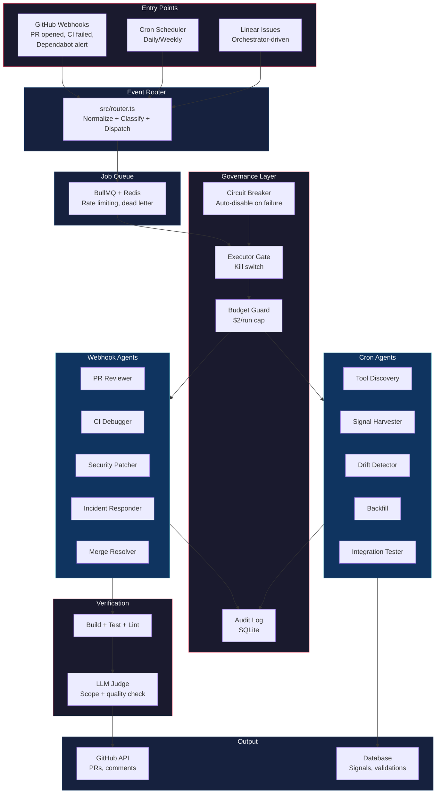
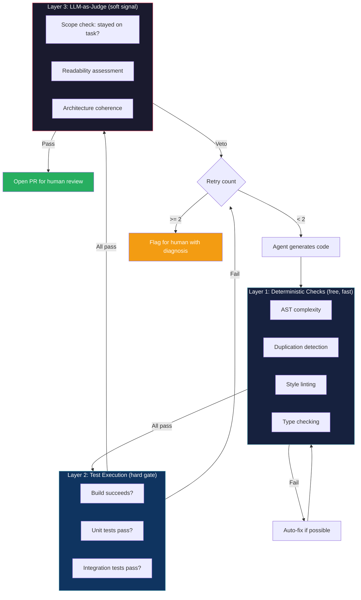

# Software Factory

An agent-native software delivery platform that autonomously handles PR review, CI debugging, security patching, incident response, and merge conflict resolution. Background agents work continuously — developers stay **on the loop** instead of in the loop.

**Key thesis:** Agents produce working but low-quality code, and instruction-based constraints (CLAUDE.md, AGENTS.md) don't enforce quality. The solution is programmatic verification — deterministic checks + LLM judge + bounded retries. See [`docs/karpathy-software-factory-thesis.md`](docs/karpathy-software-factory-thesis.md) for the full evidence base.

---

## Why Build This?

Three companies have proven this pattern at scale:

| Company | System | Result | Key Insight |
|---------|--------|--------|-------------|
| **Spotify** | [Honk](https://engineering.atspotify.com/2025/11/spotifys-background-coding-agent-part-1) | 1,500+ merged PRs, 50% of all PRs automated | Containerized K8s execution + verification loops + LLM judge |
| **Ramp** | [Inspect](https://builders.ramp.com/post/why-we-built-our-background-agent) | 30% of all PRs in months | Modal sandboxes with warm pools, multiplayer sessions, filesystem snapshots |
| **Stripe** | [Minions](https://stripe.dev/blog/minions-stripes-one-shot-end-to-end-coding-agents) | 1,300 PRs/week, zero human-written code | Goose fork + isolated devboxes (10s spin-up) + 400 MCP tools |

**The pattern is clear:** isolated sandboxes, PRs as review gates, humans review before merge.

---

## Architecture



### Two Execution Paths

**Path 1: Webhook-driven** (reactive)
```
GitHub Webhook → POST /webhook/github → EventRouter → BullMQ Queue → Worker → Agent → GitHub API
```
Triggers: PR opened/updated, CI failure, Dependabot alert. Skips bot PRs, drafts, and `skip-review` labels.

**Path 2: Orchestrator-driven** (proactive, Symphony-style)
```
Linear Issue → Orchestrator Poll → Reconciler → Workspace (git worktree) → BullMQ → Agent → GitHub API
```
Disabled by default. Polls Linear every 30s, creates isolated git worktrees per task, manages a state machine with exponential backoff and convergence detection.

Both paths converge at the BullMQ queue and share the same Agent Runner.

---

## Agent Lifecycle

Every agent follows the same lifecycle:

```mermaid
stateDiagram-v2
    [*] --> EventReceived: Webhook / Cron / Alert

    EventReceived --> GovernanceCheck: Normalize event

    state GovernanceCheck {
        [*] --> Permissions: Check executor gate
        Permissions --> BudgetCheck: Allowed?
        BudgetCheck --> [*]: Under cap?
    }

    GovernanceCheck --> ContextBuild: Passed

    state ContextBuild {
        [*] --> FileTree: Read repo structure
        FileTree --> RecentChanges: Git log / diff
        RecentChanges --> RelevantCode: Scope to affected files
        RelevantCode --> [*]
    }

    ContextBuild --> AgentReasoning: Full context ready

    state AgentReasoning {
        [*] --> LLMCall: Analyze problem
        LLMCall --> GenerateFix: Produce code changes
        GenerateFix --> [*]
    }

    AgentReasoning --> Verification: Changes generated

    state Verification {
        [*] --> LocalChecks: Lint + format
        LocalChecks --> TestExecution: Build + test in sandbox
        TestExecution --> LLMJudge: Passes? Scope check
        LLMJudge --> Retry: Veto? (max 2 retries)
        Retry --> LocalChecks: Try again
        LLMJudge --> Approved: Looks good
        Approved --> [*]
    }

    Verification --> Output: Verified

    state Output {
        [*] --> CreatePR: Open PR with explanation
        CreatePR --> AuditLog: Log all actions
        AuditLog --> [*]
    }

    Output --> HumanReview: PR ready
    HumanReview --> [*]: Merge or reject
```



---

## Agents

### Webhook Agents (can modify repos)

| Agent | Trigger | Output | Constraints |
|-------|---------|--------|-------------|
| **PR Reviewer** | `pull_request.opened` / `synchronize` | Review comments + approve/request changes | Cannot create PRs |
| **CI Debugger** | `check_suite.completed` (failure) | Diagnosis comment + fix PR | Max 10 files, 200 lines |
| **Security Patcher** | `dependabot_alert.created` | Patch PR | Lockfiles only |
| **Incident Responder** | PagerDuty / custom alert | RCA + fix PR | Max 10 files, 200 lines |
| **Merge Resolver** | PR with conflict label | Conflict resolution commit | Max 20 files, 500 lines |

### Cron Agents (read-only data pipeline)

| Agent | Schedule | Purpose | Cost |
|-------|----------|---------|------|
| **Tool Discovery** | Daily 3 AM | Find new developer tools via LLM | ~$1.50/day |
| **Signal Harvester** | Daily 2 AM | Refresh GitHub stars, npm downloads | Free |
| **Drift Detector** | Daily 4 AM | Detect deprecated/archived tools | ~$0.50/day |
| **Backfill** | Daily 1 AM | Enrich incomplete product profiles | ~$3.00/day |
| **Integration Tester** | Weekly (disabled) | Verify integrations in Docker | Free |

Cron agents have `blockedFilePatterns: ['**/*']` — they cannot modify any files. Lower cost limits. Use cheaper models (Gemini Flash) by default.

---

## Safety & Governance

Five layers checked in order on every agent run:

1. **Global Daily Budget** — Hard cap across all agents (default $20/day). Warns at 80%.
2. **Executor Gate** — Kill switch via `executor_gate.json`. Hot-reloaded on every check.
3. **Per-Agent Governance** — File patterns, max files/lines changed, cost limit, PR creation rights.
4. **Circuit Breaker** — Per-API (OpenRouter, GitHub, Linear). Opens after 3 consecutive failures, half-open test after 60s.
5. **Timeout** — Agent runs race against configurable timeout (default 300s).

---

## Verification Architecture

The quality problem is industry-wide. Alibaba's SWE-CI benchmark shows 75% of agents break working code. AI PRs have 1.7x more issues than human PRs (CodeRabbit, 470 PRs). Three layers of verification address this:



**Why three layers?**
- Layer 1 catches 60%+ of issues for free
- Layer 2 is the hard gate — if it doesn't build/test, it doesn't ship
- Layer 3 catches subtle quality issues (scope creep, readability) that deterministic tools miss
- Goodhart's Law risk: agents optimized for LLM judge approval will game the metric — hard constraints are the real gate

---

## Context Engineering

From Spotify's Part 2 — context engineering is the single biggest lever for agent quality.

**Prompt design:**
- Describe the end state, not step-by-step instructions
- State preconditions — tell the agent when NOT to act
- Use concrete examples — code snippets heavily influence output quality
- One change at a time — combining changes exhausts context and produces partial results
- Define success as tests — "make this code better" fails; "these tests should pass" succeeds

**Tool strategy:**
- Spotify: minimal tools (verify MCP, Git, restricted Bash). Context goes in the prompt.
- Stripe: 400+ MCP tools via Toolshed, pre-hydrated before agent starts.
- Start constrained, add tools only when prompts aren't enough.

**Conditional rules (Stripe pattern):**
- Global agent rules don't work in large codebases — they conflict across domains
- Apply rules conditionally by subdirectory
- Use scoped config files (CLAUDE.md, AGENTS.md) per directory

---

## Tech Stack

| Layer | Technology | Why |
|-------|-----------|-----|
| **Runtime** | Node.js + TypeScript | Type safety, ecosystem |
| **Server** | Hono | Lightweight, fast |
| **LLM** | OpenRouter | Model-agnostic (Claude, GPT, Gemini) |
| **GitHub** | Octokit + GitHub App auth | PR creation, review comments |
| **Queue** | BullMQ + Redis | Reliable event processing |
| **Local DB** | SQLite (better-sqlite3) | Audit logs, agent state |
| **External DB** | Supabase (PostgreSQL) | Signals, validations |
| **Sandbox** | Docker containers / git worktrees | Isolated execution per agent |

---

## Quick Start

```bash
git clone <repo-url>
cd software-factory
npm install
cp .env.example .env
# Configure: GitHub App credentials, OpenRouter API key, Redis URL
npm run dev
```

For webhook development:
```bash
npm run tunnel  # Exposes localhost:3847 via localtunnel
```

---

## Design Principles

1. **PRs are the review gate** — Every agent action produces a PR or comment. Nothing merges without human approval.

2. **Hooks over instructions** — CLAUDE.md rules get violated. Only hooks that `exit 2` mechanically enforce constraints. The governance layer (executor gate, LLM judge, verification loops) implements this.

3. **Bounded blast radius** — Each agent operates on scoped files with cost caps. A security agent can't refactor your auth system.

4. **Shift feedback left** — Catch errors locally before expensive CI. Local lint in <5s, then CI only if local passes. Max 2 CI retry rounds.

5. **Verification loops, not hope** — Agents must call verifiers before opening PRs. Verifiers are black boxes to the agent. LLM judge catches scope creep.

6. **Cattle, not pets** — Every sandbox is identical and disposable. Pre-warmed from a pool, torn down after use. No persistent agent state.

7. **3 focused workers > 10 parallel** — Production fleet data shows focused, scoped agents outperform swarm patterns. Each agent handles one task type well.

---

## Project Structure

```
src/
  index.ts                    # Webhook server (Hono)
  router.ts                   # Event normalization + agent dispatch
  types.ts                    # Shared type definitions
  agents/
    pr-reviewer.ts            # PR review agent
    ci-debugger.ts            # CI failure investigation + fix
    security.ts               # CVE/dependency patching
    incident.ts               # Production incident response
    merge.ts                  # Merge conflict resolution
    runner.ts                 # Agent execution harness
    judge.ts                  # LLM judge (diff validation)
    prompts/                  # Agent system prompts (markdown)
    cron/                     # Data pipeline agents
      tool-discovery.ts
      signal-harvester.ts
      drift-detector.ts
      backfill.ts
      integration-tester.ts
  core/
    budget-guard.ts           # Per-agent cost tracking + caps
    circuit-breaker.ts        # Failure detection + auto-disable
    context.ts                # Repo context builder
    db.ts                     # SQLite audit log + migrations
    executor-gate.ts          # Kill switch
    flywheel.ts               # Product confidence scoring
    github.ts                 # GitHub API client
    governance.ts             # Permissions + blast radius
    llm.ts                    # OpenRouter client with cost tracking
    redis.ts                  # Shared Redis connection config
    retention.ts              # Data retention (90-day prune)
    scheduler.ts              # Cron schedule management
    startup-checks.ts         # Fail-fast config validation
    supabase.ts               # External DB connection
    webhook.ts                # GitHub webhook signature verification
  orchestrator/
    orchestrator.ts           # Symphony-style reconciliation loop
    reconciler.ts             # Task lifecycle management
    state.ts                  # State machine with backoff
    workspace.ts              # Git worktree isolation
    workflow.ts               # WORKFLOW.md config parser
    linear.ts                 # Linear API client
  queue/
    queue.ts                  # BullMQ job definitions
    worker.ts                 # BullMQ worker processing
docs/                         # Research corpus (34 documents)
```

---

## References

### Production Systems
- [Spotify Honk Part 1](https://engineering.atspotify.com/2025/11/spotifys-background-coding-agent-part-1) — 1,500+ PRs, containerized K8s execution
- [Spotify Honk Part 2](https://engineering.atspotify.com/2025/11/context-engineering-background-coding-agents-part-2) — Context engineering, Claude Code as top agent
- [Spotify Honk Part 3](https://engineering.atspotify.com/2025/12/feedback-loops-background-coding-agents-part-3) — Verification loops, LLM judge (~25% veto rate)
- [Ramp Inspect](https://builders.ramp.com/post/why-we-built-our-background-agent) — 30% of PRs, Modal sandboxes, warm pools
- [Stripe Minions Part 1](https://stripe.dev/blog/minions-stripes-one-shot-end-to-end-coding-agents) — 1,300 PRs/week, 400+ MCP tools
- [Stripe Minions Part 2](https://stripe.dev/blog/minions-stripes-one-shot-end-to-end-coding-agents-part-2) — Devboxes, conditional rules, max 2 CI retries

### Research
- [Karpathy Software Factory Thesis](docs/karpathy-software-factory-thesis.md) — Code quality findings, instruction compliance crisis, fleet management patterns
- [Alibaba SWE-CI Benchmark](https://arxiv.org/abs/2504.08057) — 75% of agents break working code over consecutive PRs
- [background-agents.com](https://background-agents.com) — Industry overview of background agent platforms

### Research Corpus

The `docs/` directory contains 34 research documents covering: sandbox architectures, agent memory systems, harness engineering, context engineering, agent filesystems, competitive landscape, enterprise adoption, and more. See [AGENTS.md](AGENTS.md) for a navigable index.

---

## License

Private — not yet open source.
